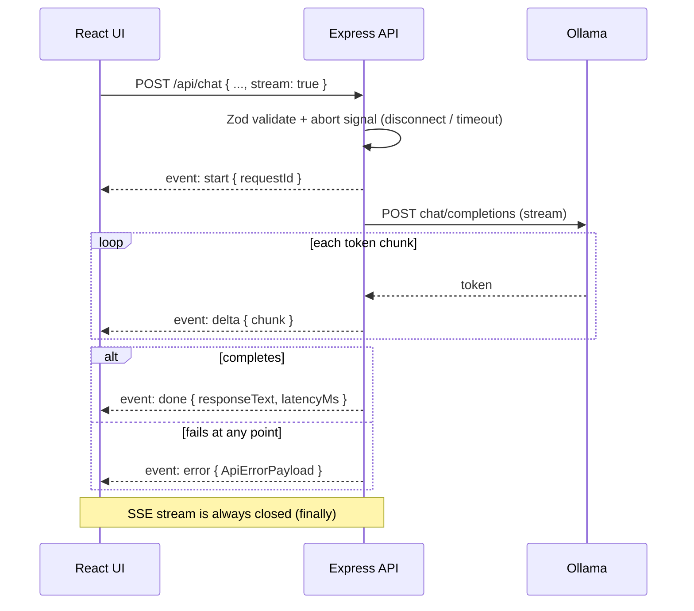
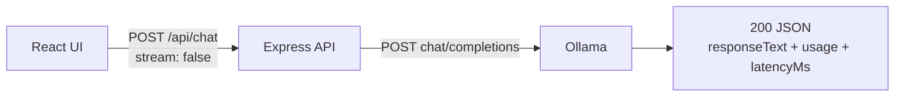
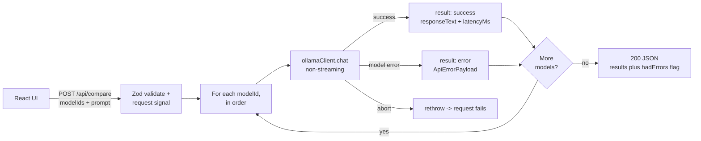
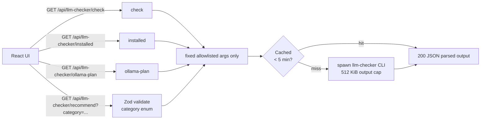

# local-llm-playground — Chat, Compare, and llm-checker Flows

Workflow diagrams for [workspaces/apps/local-llm-playground](../../../workspaces/apps/local-llm-playground/).
All routes are mounted under `/api`; the backend talks to Ollama through its
OpenAI-compatible endpoint (`OLLAMA_BASE_URL`, default
`http://localhost:11434/v1`).

Structure-level view: [docs/architecture/workspace.dsl](../../architecture/workspace.dsl).

## Chat — `POST /api/chat`

One endpoint, two modes selected by the `stream` flag. Every request gets an
abort signal that fires on client disconnect or after `REQUEST_TIMEOUT_MS`.

### Streaming (`stream: true`)

The happy path runs top to bottom; the terminal `done`-vs-`error` branch is
the only fork, and the SSE stream is always closed in a `finally` block.

### Non-streaming (`stream: false`)

One `chat/completions` call, one JSON response.

## Multi-Model Compare — `POST /api/compare`

Models run **sequentially** against the same prompt; one failing model does
not abort the run (its error is captured per result), but a client
disconnect/timeout abort stops everything.

## llm-checker — `GET /api/llm-checker/*` Allowlist Gate

The backend never passes user input into a shell. It only spawns the
`llm-checker` CLI with one of four fixed, allowlisted command shapes
(`check`, `installed`, `ollama-plan`, `recommend --category <enum>`), and
caches results for 5 minutes.

