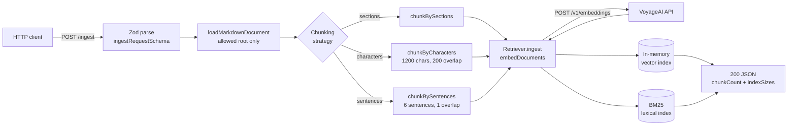
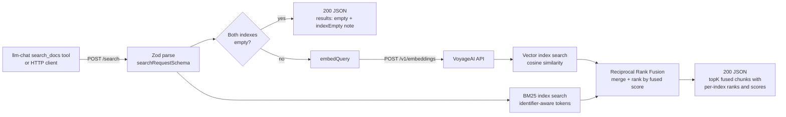

# rag-pipeline — Ingest and Retrieval Flows

Workflow diagrams for [workspaces/ai-engineering/rag-pipeline](../../../workspaces/ai-engineering/rag-pipeline/).
The service is retrieval-only: answer generation happens in
[llm-chat](../../../workspaces/ai-engineering/llm-chat/) through the optional
`search_docs` tool, which calls `POST /search` over HTTP.

Structure-level view: [docs/architecture/workspace.dsl](../../architecture/workspace.dsl).

## Ingest Flow — `POST /ingest`

A markdown document is loaded from the allowed document root (defaults to
`sample-documents/`), chunked with the requested strategy, embedded with
VoyageAI, and written into both in-memory indexes.

## Retrieval Flow — `POST /search`

Hybrid retrieval: the query is embedded and searched against the vector index
(cosine similarity) while the raw text is searched against the BM25 index;
both ranked lists are merged with Reciprocal Rank Fusion (RRF). Each index
queries `max(topK * 2, topK)` candidates before fusion; per-index ranks and
scores are preserved on every fused chunk.

Error handling is uniform: thrown errors (Zod validation, path escapes,
embedding failures) reach the Express error handler and return a structured
`{ error: { code, statusCode, ... } }` payload.
