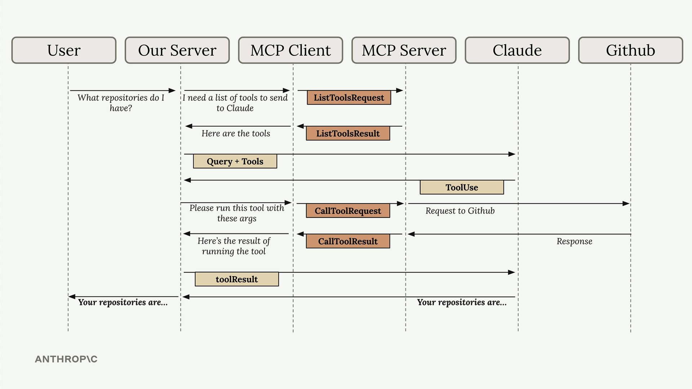

# mcp-chat

A learning/demo workspace that pairs a small document-focused MCP server with a CLI MCP client/chatbot. The chatbot streams Claude responses, lets you mention documents with `@doc_name`, runs MCP prompts as slash commands (e.g. `/format plan.md`), and is intended for manual verification through both the CLI and the official [MCP Inspector](https://modelcontextprotocol.io/docs/tools/inspector).

## Scope (v1)

- Single in-memory document store seeded in code.
- One built-in MCP server (stdio) exposing two tools, two resources, and one prompt.
- One CLI chatbot consuming the server via stdio.
- No database, no persistence across restarts, no live API calls in tests.

## How it works

A tool-using turn loops between the CLI chatbot (which embeds the MCP client), the document MCP server, and Claude:



Mapping the diagram's generic actors onto this workspace:

- **Our Server / MCP Client** — the CLI chatbot. It owns the stdio MCP client and orchestrates the turn.
- **MCP Server** — the in-memory document server exposing `read_doc_contents`, `edit_document`, the `docs://` resources, and the `format` prompt.
- **Claude** — the Anthropic API, reached through `@workspaces/packages/llm-client`.
- **Github** — only an illustrative external system in the source diagram. This workspace has no external backend; the document store lives inside the MCP server.

The sequence is: the client fetches the tool list (`ListTools`) from the server, sends the query plus tools to Claude, receives a `ToolUse`, calls the tool on the server (`CallTool`), feeds the tool result back to Claude, and streams the final answer to the user.

## SDK versions and protocol

- MCP TypeScript SDK V2 packages (alpha) — pinned exactly:
  - `@modelcontextprotocol/server@2.0.0-alpha.2`
  - `@modelcontextprotocol/client@2.0.0-alpha.2`
- Required optional peer dep: `@cfworker/json-schema@^4.1.1`. The SDK marks it as an optional peer, but the runtime imports it eagerly on alpha-2; installing it explicitly avoids `ERR_MODULE_NOT_FOUND`.
- Target MCP protocol spec: `2025-11-25` (latest at time of writing).
- Tool/resource/prompt schemas are built with `fromJsonSchema` plus `CfWorkerJsonSchemaValidator` from `@modelcontextprotocol/server`. We did not use Zod directly because Zod v4.1.12's `~standard` does not yet expose the `jsonSchema` converter the V2 alpha SDK requires.

## Layout

```
src/
  documents/         in-memory document store and seeds
  server/            document MCP server + stdio entrypoint
  client/            stdio MCP client wrapper
  chat/              tool manager, prompt converter, document context, chat session
  cli/               args parsing, readline, REPL loop, CLI entrypoint
tests/
  documents/         document store unit tests
  server/            in-memory paired-transport integration tests
  client/            MCP client wrapper tests
  chat/              tool manager, prompt converter, chat session, document context
  cli/               args parser and runChatbot integration tests
  support/           shared in-memory paired transport for tests
```

## Tools, resources, prompts

| Surface           | Name                        | Notes                                                                                  |
| ----------------- | --------------------------- | -------------------------------------------------------------------------------------- |
| Tool              | `read_doc_contents`         | Reads a document by id. Returns text + `structuredContent`.                            |
| Tool              | `edit_document`             | Replaces a unique substring. Errors on missing doc, empty/missing/duplicate `old_str`. |
| Resource          | `docs://documents`          | JSON list of all known document ids.                                                   |
| Resource template | `docs://documents/{doc_id}` | Plain-text content of an individual document. Supports `list`.                         |
| Prompt            | `format`                    | Instructs Claude to read the document and edit formatting issues if warranted.         |

## Setup

```bash
cp .env.example .env
# fill in ANTHROPIC_API_KEY
pnpm install
```

`.env` reads `ANTHROPIC_API_KEY` and optional `ANTHROPIC_MODEL`. The model defaults to `DEFAULT_MODEL` from `@workspaces/packages/llm-client`.

## Scripts

```bash
pnpm --filter mcp-chat typecheck   # tsc --noEmit
pnpm --filter mcp-chat test        # vitest run
pnpm --filter mcp-chat lint        # eslint src tests
pnpm --filter mcp-chat build       # esbuild emit to dist/
pnpm --filter mcp-chat server:dev  # tsx src/server/main.ts (stdio MCP server)
pnpm --filter mcp-chat dev         # tsx src/cli/main.ts (CLI chatbot, dev mode)
pnpm --filter mcp-chat server      # node dist/server/main.js
pnpm --filter mcp-chat chat        # node dist/cli/main.js
pnpm --filter mcp-chat inspect     # MCP Inspector against the built server
```

## CLI usage

After `pnpm --filter mcp-chat build`, run:

```bash
pnpm --filter mcp-chat chat
```

Inside the REPL:

- A plain prompt streams an assistant response token-by-token.
- `@<doc_id>` in the prompt injects the document content into the user turn.
- `@` (just the symbol) lists available documents.
- `/<command>` runs the matching MCP prompt. `/` alone lists commands.
- `/format <doc_id>` runs the `format` prompt for the given document and lets Claude call `read_doc_contents`/`edit_document`.
- `exit` or `quit` leaves the REPL.

CLI flags:

| Flag               | Effect                                                                                                                                          |
| ------------------ | ----------------------------------------------------------------------------------------------------------------------------------------------- |
| `--no-stream`      | Disable streaming. Print only the final assistant text.                                                                                         |
| `--max-tokens <n>` | Override `maxTokens` per turn (default 1024).                                                                                                   |
| `--server-dev`     | Launch the MCP server with `tsx` from TS source instead of `node dist/server/main.js`. Useful while iterating on the server without rebuilding. |
| `--help`, `-h`     | Print usage.                                                                                                                                    |

Document edits are **in-memory only** and are lost when the chat process exits.

## MCP Inspector

Inspector connects to the built server entrypoint and exposes the tools, resources, and prompts via a UI.

```bash
pnpm --filter mcp-chat build
pnpm --filter mcp-chat inspect
```

Equivalent to:

```bash
npx -y @modelcontextprotocol/inspector node workspaces/ai-engineering/mcp-chat/dist/server/main.js
```

Inspector should never see stdout noise. The stdio entrypoint only writes diagnostics to stderr and prints no startup banner.

## Manual test checklist

In Inspector:

- [ ] `tools/list` returns `read_doc_contents` and `edit_document`.
- [ ] `read_doc_contents` with an existing `doc_id` returns text and `structuredContent`.
- [ ] `read_doc_contents` with a missing `doc_id` returns `isError: true`.
- [ ] `edit_document` with a unique `old_str` updates the document and reports `replacements: 1`.
- [ ] `edit_document` errors clearly for missing doc, empty `old_str`, missing `old_str`, and multiple matches.
- [ ] `resources/read` `docs://documents` returns the JSON list of ids.
- [ ] `resources/read` `docs://documents/plan.md` returns the document text.
- [ ] `prompts/list` includes `format`; `prompts/get` for `format` with `doc_id` returns the formatting instructions.

In the CLI:

- [ ] Plain prompt streams assistant text.
- [ ] `@deposition.md` injects the document content into the user turn.
- [ ] `@` lists documents; `/` lists commands.
- [ ] `/format plan.md` runs the format prompt, shows MCP tool status lines, and prints a final summary.
- [ ] Tool status lines and streamed assistant text remain readable side-by-side.

## Risks and follow-ups

- V2 SDK alpha: API surface and import paths may shift between releases. Pin exact versions and re-verify imports when upgrading.
- The optional peer dependency `@cfworker/json-schema` is installed explicitly to work around eager runtime import in alpha-2.
- Zod is intentionally not used in this workspace; revisit once Zod v4's `~standard.jsonSchema` lands.
- Document persistence and multi-server registries are out of scope for v1.
